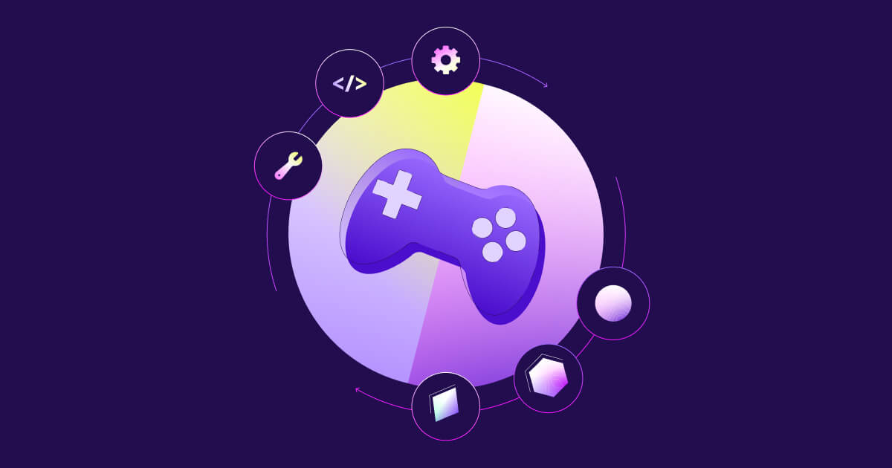

### Онлайн-магазин компьютерных игр 

---

**Описание проекта:**

GameHub-web — это онлайн-магазин, созданный для любителей компьютерных игр. Мы предлагаем широкий ассортимент игр, включая новинки и бестселлеры, а также удобный интерфейс для покупок и управления личным кабинетом. 

---

# MVP1: GameHub-web 

- **Главная страница (Мухаметов Тимур)**
  - Логотип магазина
  - Главное навигационное меню, кнопки для входа и регистрации пользователей
  - Новые продукты и бестселлеры

- **Корзина покупок (Майорова Анастасия)**
  - Список товаров
  - Ценовой лист
  - Описание игр

- **Страница игры (Макарова Екатерина)**
  - Информация о продукте
  - Системные требования
  - Комментарии и рейтинги
  - Цена

- **Категории (Ахмадуллина Эмилия)**
  - Сортировка игр
  - Топ-продаж
  - Новинки
  - Специальные предложения

- **Личный кабинет (Федорова Елена)**
  - Вход или авторизация
  - Личная информация
  - Мои покупки
  - Помощь

---

## MVP2: Расширенные функции GameHub-web 

### Новые возможности для пользователей:

- **Поиск по играм (Мухаметов Тимур)**
  - Поиск по всей базе игр
  - Добавление игр в корзину прямо из результатов поиска
  - Вывод списка игр в отдельной странице по категориям и при нажатии на кнопку поиска

- **Промокоды и скидки (Майорова Анастасия)**
  - Добавление промокодов, позволяющей пользователям получать скидки на покупки
  - Добавление базы данных для хранения промокодов

- **Улучшенная система комментариев (Макарова Екатерина)**
  - Сортировка комментариев по различным критериям
  - Функция лайков для комментариев
  - Добавление поддержки английского языка (по возможности)
  - Интерактивная галерея изображений игр 

- **Фильтрация и избранное (Ахмадуллина Эмилия)**
  - Фильтрация категорий
  - Возможность добавления игр в избранное, чтобы сохранить самые желаемые продукты
  - Отдельная страница избранного для удобного доступа к сохраненным играм

- **Обновленный интерфейс (Федорова Елена)**
  - Изменение футера и улучшение функционала входа и регистрации
  - Создание кнопки для быстрого перехода из личного кабинета в раздел избранного

---

[Посмотреть дизайн в Figma](https://www.figma.com/file/qURRXeUGf5GBGJcVyZkoyr/main_sheet?type=design&node-id=0%3A1&mode=design&t=2EXSWHVVS405mJid-1)

---

С нетерпением ждем вашего мнения и предложений по улучшению нашего проекта!
